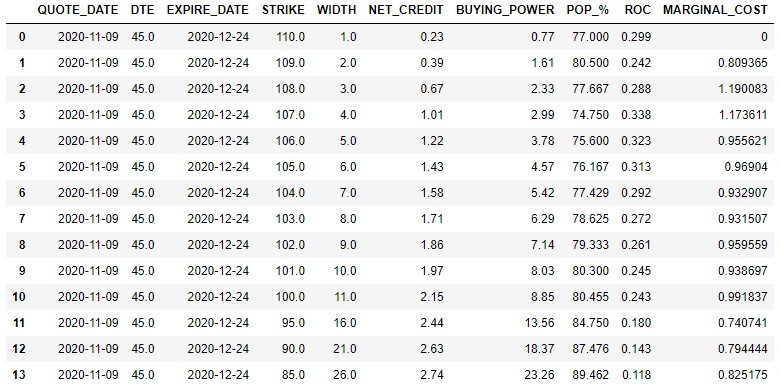

# Vertical leg determination
When the trade is risk defined (*Vertical spread*) the losses are limited but we lower the probability of profit

As we widen our strike, our profit and probability of success increases acting more as an naked trade however, at which point is marginal cost of widening strikes too high?

**Marginal cost** is percentage of ROC (*return of capital*) you keep when widening the strike width by 1 point.
- Marginal cost = (wider spread credit / wider spread buying power) / (narrow credit / narrow buying power)

### How do we determine which long legs to purchase when shorting spreads?
- The ideal trading width for spreads is between 5-10
- Marginal cost helps find the ideal long legs to purchase within those range.
- The higher the marginal cost, less reduction of ROC when widening our strikes

